# Group Report — Day 02

## Thành viên nhóm

| STT | Họ và tên | Mã học viên | Vai trò trong nhóm |
|---|---|---|---|
| 1 | Vũ Hải Nam | 2A202601173 | Nhóm trưởng |
| 2 | Ngô Đình Khánh | 2A202601625 | Thành viên |
| 3 | Lê Thị Thuý | 2A202601381 | Thành viên |
| 4 | Nguyễn Minh Nhật | 2A202601131 | Thành viên |
| 5 | Ong Xuân Sơn | 2A202601327 | Thành viên |
| 6 | Nguyễn Duy Dũng | 2A202601505 | Thành viên |
| 7 | Giang Minh Phú | 2A202601729 | Thành viên |
| 8 | Dương Minh Quân | 2A202601903 | Thành viên |
| 9 | Trần Thị Kiều Oanh | 2A202601417 | Thành viên |
| 10 | Phí Đình Hoàng Anh | 2A202601853 | Thành viên |
| 11 | Nguyễn Tiến Thành | 2A202601539 | Thành viên |
| 12 | Ngô Việt Anh | 2A202601579 | Thành viên |

## Group convergence

Nhóm 3-4 người, mỗi người share top 3. Tổng cộng khoảng 12 candidates.

| Cluster | Candidate examples | Pattern chung |
|---|---|---|
| Quản lý Task & Deadline | Ưu tiên công việc sát deadline, Gom deadline bài tập rải rác | Khi có nhiều task/deadline từ nhiều nguồn, rất dễ sót và không biết làm cái nào trước. |
| Báo cáo / tổng hợp thông tin | Tổng hợp báo cáo tuần, Viết update tuần cho nhóm | Gom thông tin từ nhiều nguồn rời rạc rồi viết lại cho người khác đọc. |
| Giáo dục / Trợ lý học thuật | Chấm bài tự luận tự động, Tra từ tiếng Anh theo ngữ cảnh | Áp dụng AI để đánh giá (chấm điểm) hoặc tra cứu hỗ trợ học tập. |

## Shortlist và score

| Candidate | Actor rõ | Workflow rõ | Pain có evidence | Impact đo được | Làm trong lab | So sánh R/W/A được | Nhóm hiểu domain | Tổng |
|---|---:|---:|---:|---:|---:|---:|---:|---:|
| Ưu tiên công việc trước thời hạn | 5 | 5 | 5 | 5 | 5 | 5 | 5 | 35 |
| Gom deadline bài tập rải rác | 4 | 4 | 4 | 3 | 4 | 3 | 3 | 25 |

Nhóm chọn: **Ưu tiên công việc trước thời hạn**.

Vì sao chọn:
- Có workflow rõ ràng (các bước check deadline và assign task).
- Có baseline thời gian (mất 60 phút rà soát mỗi cuối sprint).
- Vấn đề "hoảng loạn, lo vội" khi deadline cận kề rất phổ biến trong mọi project.
- Rất dễ phân định AI can thiệp vào bước nào (tóm tắt comment) và con người duyệt ở bước nào (assign người).

Vì sao không chọn các bài khác:
- Gom deadline bài tập rải rác: Impact hẹp hơn một chút (chỉ tập trung vào cá nhân sinh viên) so với impact toàn dự án của việc ưu tiên task.

## Quick validation

Nhóm hỏi nhanh 3 PM/Team Lead quen biết.

| Nguồn | Số người | Tín hiệu xác nhận | Tín hiệu phản bác | Nhóm sửa problem thế nào |
|---|---:|---|---|---|
| Quick interview | 3 | 2/3 người xác nhận sát deadline bảng Kanban rất lộn xộn, mọi người comment quá nhiều vào task khiến PM không kịp đọc để biết ai cần cứu viện. | 1 người bảo chỉ cần bắt mọi người dán nhãn "Blocked" và tag tên PM là xong. | Vẫn giữ hướng AI nhưng nhấn mạnh vào việc "đọc/hiểu context bị tắc nghẽn" thay vì chỉ là thiếu nhãn dán. |

Insight sau validation:
```text
Pain thật không nằm ở việc "không nhìn thấy task trễ", mà nằm ở chỗ PM phải tốn quá nhiều thời gian đọc hiểu hàng loạt comment dài dòng trong task để biết "tại sao nó trễ" và "ai rảnh để hỗ trợ ngay bây giờ".
```

## Research giải pháp

Nhóm tìm các hướng đã có sẵn, không giả định phải tự build từ đầu.

| Nguồn / tool / case | Link | Họ giải quyết phần nào? | Điểm mạnh | Khoảng trống / rủi ro | Bài học cho nhóm |
|---|---|---|---|---|---|
| Jira Automation | https://support.atlassian.com/jira-software-cloud/docs/automate-your-jira-cloud-processes/ | Tự động đổi màu/gắn nhãn khi task quá hạn (Rule) | Tự động hóa tốt, nhanh | Là Rule cứng, không đọc hiểu được tại sao bị quá hạn hay kẹt ở đâu | Rule đủ để gạn lọc task sắp trễ hạn, nhưng chưa đủ để phân tích nguyên nhân |
| Jira Intelligence (AI) | https://www.atlassian.com/software/artificial-intelligence | Tóm tắt các comment dài trong một task (AI) | Giúp PM hiểu nhanh bối cảnh bị kẹt | Chưa tự động so sánh được lịch của thành viên khác để suggest người hỗ trợ | Pattern rất hay: AI chỉ làm nhiệm vụ tóm tắt ngữ cảnh, quyết định phân việc lại vẫn do con người (PM) làm |

Research takeaway:
```text
Không nên build một Agent tự động phân lại việc (vì rất rủi ro, có thể giao sai người). Hướng an toàn nhất là Workflow: Dùng Rule lọc các task còn <24h, dùng AI tóm tắt nguyên nhân bị kẹt từ các comment, sau đó PM đọc tóm tắt và tự quyết định phân người hỗ trợ.
```

## Workflow before/after

File nhóm nộp kèm:
```text
02-group-problem-statement-workflow.png/pdf/md
```

Nội dung workflow:

```mermaid
graph TD
    subgraph Current_State [CURRENT STATE — 60 phút]
        A1[1. PM rà soát bảng Kanban tìm task <24h: 5'] --> B1[2. PM click vào từng task và đọc hết comment: 40']
        style B1 fill:#f9f,stroke:#333,stroke-width:2px
        B1 --> C1[3. PM ra chat nhóm hỏi ai rảnh không: 10']
        C1 --> D1[4. PM assign người hỗ trợ: 5']
    end

    subgraph Future_State [FUTURE STATE — 15 phút]
        A2[1. Auto-filter task <24h: 1'] -->|Rule/script| B2[2. AI tóm tắt comment báo lỗi/kẹt: 2']
        style B2 fill:#bbf,stroke:#333,stroke-width:2px
        B2 -->|Workflow step| C2[3. PM xem bảng tóm tắt và kiểm tra người rảnh: 10']
        style C2 fill:#bfb,stroke:#333,stroke-width:2px
        C2 --> D2[4. PM tự assign người hỗ trợ: 2']
    end
```



**Fallback:**
AI tóm tắt sai hoặc không ra ý -> PM bỏ tóm tắt và tự click vào task đọc comment như cũ.

**Bottleneck mới:**
PM xem bảng tóm tắt và kiểm tra lịch rảnh của team. Đây là bottleneck chấp nhận được vì đó là điểm kiểm soát chất lượng phân công.

Before/after impact:

| Metric | Trước | Sau kỳ vọng | Ghi chú |
|---|---:|---:|---|
| Tổng thời gian rà soát | 60 phút | 15 phút | Target chính để cứu vãn deadline kịp thời |
| Số bước | 4 | 4 | Không giảm bước, nhưng giảm hẳn công sức ở bước đọc hiểu comment |
| Bước thủ công | 4/4 | 2/4 | PM vẫn là người duyệt cuối và assign việc |
| Bottleneck chính | Tự đọc hiểu hàng chục comment kỹ thuật | Xem tóm tắt ngắn của AI | Giảm tải nhận thức (Cognitive overload) |
| Risk mới | Không có AI hallucination | Có hallucination risk | Cần review (đọc lại tóm tắt) trước khi assign |

## Problem Statement v0

| Field | Nội dung |
|---|---|
| **Actor** | Project Manager (PM) hoặc Team Lead quản lý dự án. |
| **Workflow** | Gần deadline, PM rà soát task -> phát hiện task kẹt -> đọc comment tìm lý do -> hỏi người rảnh -> assign hỗ trợ. |
| **Bottleneck** | Việc tự đọc hiểu hàng loạt comment kỹ thuật để biết tại sao kẹt mất quá nhiều thời gian, làm chậm quá trình "cứu viện". |
| **Impact** | Mất tới 1-2 tiếng mỗi cuối sprint để điều phối, dễ bị trễ deadline chung do phát hiện kẹt quá chậm. Mọi người hoảng loạn, lo vội. |
| **Success Metric** | Giảm thời gian rà soát và điều phối task kẹt từ 60 phút xuống dưới 15 phút. |
| **Boundary** | AI chỉ được phép tóm tắt lý do kẹt. AI KHÔNG được phép tự ý thay đổi Assignee của task. Quyết định giao việc bắt buộc phải do con người làm. |

## Rule / Workflow / Agent

| Mức | Phương án | Khi nào đủ | Rủi ro | Chọn? |
|---|---|---|---|---|
| **Rule** | Dùng filter tự động đổi màu task trên Jira/Trello khi sát deadline. | Đủ nếu nguyên nhân chậm trễ luôn rõ ràng và dễ thấy. | Không giúp hiểu vì sao kẹt (lỗi code hay thiếu design?). PM vẫn tốn công vào đọc comment. | Không chọn làm giải pháp chính (chỉ dùng ở bước 1) |
| **Workflow** | Lọc task sát deadline -> LLM đọc/tóm tắt comment -> PM đọc tóm tắt và tự assign cứu viện. | Hợp lý, kết hợp được tính tự động của Rule và khả năng ngôn ngữ của AI. | AI tóm tắt ảo giác, bỏ lỡ chi tiết quan trọng. | Chọn |
| **Agent** | AI quét task trễ -> tự tổng hợp -> tự check lịch nhóm -> tự đổi assignee sang người mới. | Khi quy trình cực kỳ rạch ròi, team ai cũng thay thế được cho nhau. | Giao nhầm task cho người không có skill phù hợp, gây loạn project. | Chưa chọn |

Mức chọn:
```text
Workflow.
```

Vì sao:
- Việc gom/lọc task có thể dùng rule.
- Việc đọc hiểu lỗi/cảnh báo từ comment kỹ thuật cần AI ngôn ngữ hỗ trợ.
- PM vẫn là người review và phân việc nên risk được kiểm soát hoàn toàn.
- Chưa cần agent vì việc phân công nhân sự cần sự đánh giá linh hoạt của con người.

## Problem Statement v1

| Field | Nội dung |
|---|---|
| **Actor** | Project Manager (PM) hoặc Team Lead quản lý dự án. |
| **Workflow** | Gần deadline, hệ thống lọc task <24h -> AI tóm tắt comment -> PM đọc tóm tắt trên dashboard -> tự quyết định assign hỗ trợ. |
| **Bottleneck** | Việc tự đọc hiểu hàng loạt comment kỹ thuật để biết tại sao kẹt mất quá nhiều thời gian, làm chậm quá trình "cứu viện". |
| **Impact** | Mất tới 1-2 tiếng mỗi cuối sprint để điều phối, dễ bị trễ deadline chung do phát hiện kẹt quá chậm. |
| **Success Metric** | Giảm thời gian rà soát và điều phối task kẹt từ 60 phút xuống dưới 15 phút. |
| **Boundary** | AI không được quyền đổi trạng thái hay đổi người phụ trách (assignee) của task. |
| **AI intervention point** | Chen vào giữa bước "Phát hiện task kẹt" và "Báo cáo cho PM". AI chịu trách nhiệm đọc comment và tóm tắt rủi ro. |
| **Mức chọn** | Workflow: rule lọc task, AI draft tóm tắt, PM review. |
| **Rủi ro & người thật kiểm tra** | Rủi ro: AI ảo giác, hiểu sai comment kỹ thuật. Người kiểm tra: PM đọc tóm tắt, nếu thấy vô lý có thể bấm vào xem lịch sử comment gốc. |

## Final decision

Decision:
```text
Go với scope nhỏ.
```

Pilot nhỏ nhất:
- Thay vì tích hợp thẳng vào Jira/Trello, PM sẽ lấy 10 task bị trễ trong dự án gần nhất.
- Copy paste toàn bộ comment vào ChatGPT/Gemini để xem AI tóm tắt kỹ thuật có đúng và đủ ý để ra quyết định hay không.
- PM đo thời gian edit và kiểm chứng chất lượng.

Exit / rollback:
- Nếu AI liên tục tóm tắt sai/bịa lý do ở 70% các task, hạ xuống giải pháp Rule + PM đọc tay truyền thống.

Decision rationale:
- Problem rõ, workflow rõ, metric rõ.
- Có non-AI components (Rule).
- AI nằm ở một bước cụ thể, không ôm toàn bộ workflow.
- Human review rõ ràng (PM chốt người làm).
